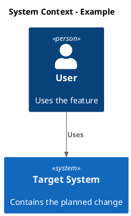

# Task Workflow

Treat markdown task files as the repository's work queue. Read them before acting, work on one task at a time, edit only the selected task unless asked otherwise, and update its status and notes as work advances.

## Board Model

The default task root is `.workbench/tasks`. Each task is a markdown file under that root. Status is represented by the task file's `status` property. `order` is an integer priority and sort key.

Supported statuses:

- `Backlog`: User-managed ideas not yet pulled into agent work.
- `Planning`: Requires codebase research and an implementation plan before user review.
- `InProgress`: Work is underway; update its notes and checklist as work advances.
- `Completed`: Finished and verified. Do not reopen unless the user asks or current verification proves it incomplete.

Use these exact values and capitalization. Do not represent workflow state with a folder, a separate shared board, or a `blocked` status. Record blockers in task notes while leaving the task in its current status unless the repository defines a separate status for blocked work.

## Task Files

Keep filenames stable unless renaming is necessary for clarity. Use a short, filesystem-safe filename that matches the task title when creating a task.

Each task file must contain an H1 title, `status`, `order`, and a useful goal. Add a checklist and continuity notes for actionable work. Keep properties in the board's bullet-property style:

```markdown
# Task title

- status: Backlog
- order: 100
- goal: Implement the scoped change, verified by focused tests, while preserving existing public behavior outside the task boundary.
- steps:
    - [ ] Research current behavior
    - [ ] Implement scoped change
    - [ ] Run focused tests

Longer task description, user comments, research notes, plan, verification notes, blocker details, or completion summary.
```

Supported fields:

- `status`: required; one of the statuses in Board Model. It is the sole source of truth for workflow state.
- `order`: required positive integer. Lower values take priority. Create and renumber with wide gaps—normally `100`, `200`, `300`—so a task can be inserted between two others without renumbering the whole board (for example, use `150` between `100` and `200`).
- `goal`: compact, auditable completion contract: desired end state, verification evidence, important boundaries, and what to report if blocked.
- `updated`: optional ISO date for longer tasks.
- `steps`: checklist of concrete work items.

Do not invent due dates, labels, estimates, or review/acceptance properties. Add or update only fields that help selection, planning, implementation, verification, or future continuation.

## Validation Script

Run `uv run .agents/skills/tasks-workbench/scripts/validate_tasks.py` after changing task files, and before handing off a task workflow change. Pass an alternative task root as its optional argument when needed. Run `uv run .agents/skills/tasks-workbench/scripts/test_validate_tasks.py` after changing the validator; it creates isolated temporary task files and exercises every validation rule.

## Task Selection

When the user says to proceed, continue, work the board, pick the next task, or similar:

1. Read direct-child `.md` task files under the task root, and parse `status` and `order`.
2. Do not auto-select malformed tasks. Report invalid records; repair them only when the intended value is unambiguous.
3. Select a task explicitly named by the user. Otherwise, resume the lowest-order `InProgress` task, then the lowest-order `Planning` task. If the user asks to start or pick new work and neither exists, pull the lowest-order `Backlog` task by setting it to `Planning` before research.
4. Break equal orders by relative path and report the duplicate. Never auto-select `Completed`.
5. If nothing is actionable, report status counts, invalid records, and the smallest decision needed.

## Workflow By Status

### Backlog

Modify Backlog tasks only when explicitly asked. Before researching or planning a pulled task, set it to `Planning`. Backlog tasks are not required to follow task file format.
Tasks without a `status` are treated as Backlog.

### Planning

Research before planning. Inspect relevant code, tests, contracts, docs, and recent task notes. Use `rg`/`rg --files` first for local search. Browse the internet only when the task depends on current external facts or the user asks for external research. Keep the plan reliable, edge-case aware, and strictly scoped. Tests should be focused, fast, and verify the goal without assuming unrelated behavior.

If the current task title or filename is vague, stale, or misleading, rename it during planning so its `#` heading and filename reflect the real scope. Keep the new name concise and specific; do not rename a clear task merely for cosmetic consistency.

Then update the selected task with a concise implementation plan:

```markdown
- status: Planning
- order: 100
- goal: [Preserve or refine the auditable implementation outcome.]
- steps:
    - [ ] Implement step...
    - [ ] Verify behavior...

Original task:
~~~
Put here verbatim user task request.
~~~

Research:
- Finding...

Plan:
- Step...

Change diagrams:
- System Context:
- Container:
- Component:
- Code (only if needed):
- Flow (only if needed):

Verification:
- Test or check...
```

Leave a researched task in `Planning` for review. When the user authorizes implementation, set it to `InProgress` before editing code.

#### Diagrams

For tasks that modify code, include System Context, Container, and Component C4 views in PlantUML. Do not use Mermaid for these views. Use the matching C4-PlantUML include and macros, following this pattern:



Use Mermaid only for Code and Flow views. Add a small class diagram when focused code structure needs clarification; omit it for broad features or large refactors. Add a small sequence, activity, or flowchart diagram only when the task changes an important flow. Avoid semicolons in sequence-message text; Mermaid treats them as statement separators. Split any code or flow diagram that becomes large or complex. Label new, changed, and removed elements.

### InProgress

Implement the task end to end. Keep edits narrow and aligned with repository conventions. Update contracts, DTOs, tests, docs, or examples only when the task requires those surfaces to stay consistent.

Follow KISS, YAGNI, and SOLID. Avoid unnecessary refactors, add abstractions only when they provide clear value, and preserve behavior outside the task scope. If blocked, update the task with what was tried and the decision or input needed.

After implementation:

1. Run the most focused verification available.
2. If it passes, update checklist state, add a short completion note with the checks run, and set `status: Completed`.
3. If it fails or a blocker remains, keep `status: InProgress` with a concrete reason and next action.

### Completed

Completed tasks should include enough notes to explain what changed and how it was verified. Do not edit them except to add missing verification context, correct an obvious recordkeeping mistake, or respond to a user request.

Preserve task formatting and `order` unless reprioritizing or placing a new task. Record research, decisions, blockers, verification, and completion details briefly in the selected task.

## Response Format

When you finish a task workflow turn, report:

- Selected task and starting status.
- What changed in code and task file state.
- Verification run and result.
- Current task status, order, and next action.

Keep the final response concise. The task file should carry detailed continuity notes; the chat response should summarize the outcome.
