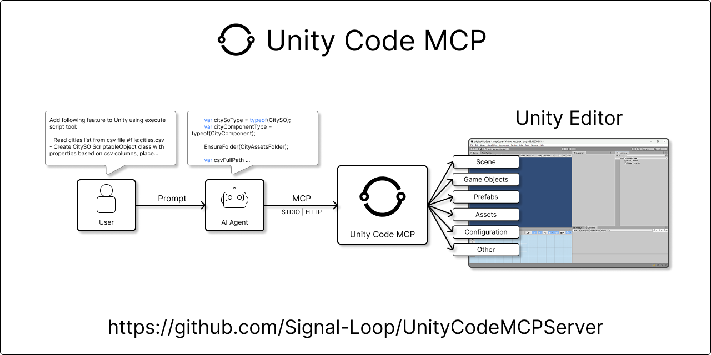
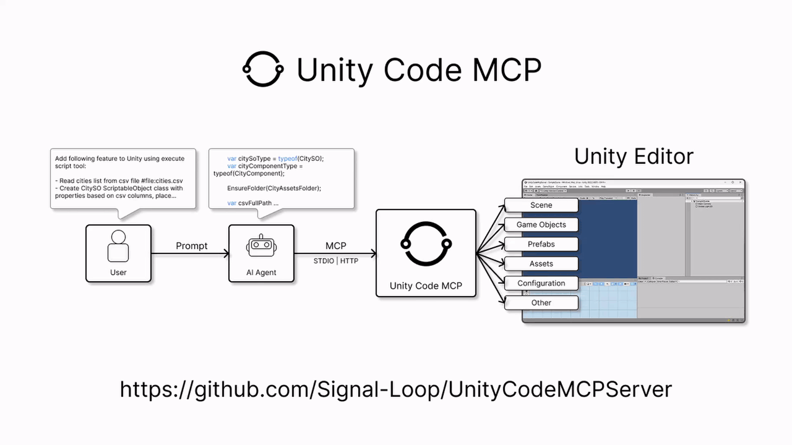
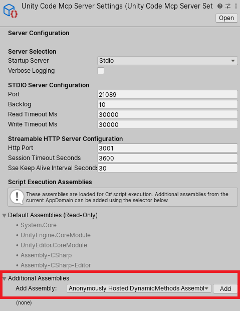

# Unity Code MCP Server

Unity Code MCP Server is a powerful tool for the Unity Editor that gives AI Agents ability to perform any action using Unity Editor API. This includes scripts, scenes, prefabs, assets, configuration changes, and more.



## Real workflow example

<details>
<summary><strong>User prompt</strong></summary>

```
Add following feature to Unity using execute script tool:

- Read cities list from csv file #file:cities.csv
- Create CitySO ScriptableObject class with properties based on csv columns, place it in Assets/Scripts/ScriptableObjects
- Create assets for each city in the csv file, populate properties with data from the file, place them in Assets/ScriptableObjects
- Create CityComponent MonoBehaviour class with a reference to CitySO ScriptableObject and place it in Assets/Scripts
- Create Map root gameobject in the current scene
- For each city asset, create a City gameobject as a child of Map, set its position based on the coordinates from the asset, add CityComponent and assign the corresponding CitySO asset
- To each City gameObject add SpriteRenderer component and assign a default sprite from Assets/Images/City.png
```

</details>
<details>
<summary><strong>AI Agent Result</strong></summary>


```
Implemented the full “cities from CSV → assets → scene” pipeline.

- Added `CitySO` ScriptableObject: CitySO.cs
- Added `CityComponent` MonoBehaviour: CityComponent.cs
- Added the CSV data file: cities.csv
- Ran an Editor execution script that:
  - Created 49 `CitySO` assets in ScriptableObjects
  - Created a `Map` root GameObject in the active scene with 49 `City` children
  - Set each city position from `Coordinates`, added `CityComponent` and assigned the matching `CitySO`
  - Added `SpriteRenderer` to each city and assigned the default sprite from City.png
```

</details>



Full chat transcript: [ChatTranscript.md](Assets/Plugins/UnityCodeMcpServer/Documentation~/Examples/ChatTranscript.md). Repository contains solution with result.

## Table of contents

- [Features](#features)
- [Security considerations](#security-considerations)
- [Architecture](#architecture)
- [Quick start](#quick-start)
- [Built-in tools](#built-in-tools)
- [Extending (adding tools)](#extending-adding-tools)
- [Script execution context](#script-execution-context)
- [STDIO bridge](#stdio-bridge)
- [Testing](#testing)
- [Known Issues](#known-issues)
- [License](#license)

## Features

- **Unity Editor / Unity Engine API access**: Perform any tasks available through public APIs or reflection
- **STDIO transport (via bridge)**: No separate server process required for MCP clients. Domain-reload safe, retries if domain reload is in progress. `uv` (Python package manager) is required.
- **Streamable HTTP transport**: Alternative to STDIO bridge for MCP clients that support HTTP. No separate server process required. No uv required. Responds with error if domain reload is in progress.
- **Extensible**: Add new tools, async tools, resources, or prompts by implementing interfaces anywhere in the codebase

### Tools

#### execute_csharp_script_in_unity_editor

Perform any task by executing generated C# scripts in Unity Editor context. Full access to UnityEngine, UnityEditor APIs, and reflection. Automatically captures logs, errors, and return values.

#### read_unity_console_logs

Read Unity Editor Console logs with configurable entry limits (1-1000, default 200)

#### run_unity_tests

Run Unity tests via TestRunnerApi. Supports EditMode, PlayMode, or both. Can run all tests or filter by fully qualified test names.

## Security considerations

This package executes LLM-generated C# code (including reflection code) with the same privileges as the Unity Editor process.

Recommendations:

- Review scripts before executing them.
- Use a separate Unity project and/or run Unity in an isolated environment (VM/container).

You are responsible for securing your environment and for any changes or data loss caused by executed scripts.

## Architecture

### STDIO Transport

```
┌─────────────┐     STDIO      ┌─────────────────┐      TCP      ┌────────────────────────────┐
│  MCP Client │ ◄────────────► │  STDIO Bridge   │ ◄───────────► │   Unity Code MCP Server    │
│  (AI Agent) │                │ (Python script) │               │       (Unity Editor)       │
└─────────────┘                └─────────────────┘               └────────────────────────────┘
```

### HTTP Transport

```
┌─────────────┐             HTTP / SSE              ┌────────────────────────────┐
│  MCP Client │ ◄─────────────────────────────────► │   Unity Code MCP Server    │
│  (AI Agent) │                                     │       (Unity Editor)       │
└─────────────┘                                     └────────────────────────────┘
```

## Quick start

### Requirements

- Unity 2022.3 LTS or higher (tested on 2022.3.62f3 and 6000.2.7f2)
- UniTask (async/await integration): https://github.com/Cysharp/UniTask
- `uv` (Python package manager) for the STDIO transport: https://docs.astral.sh/uv/, RECOMMENDED

### Installation

1. Install `uv` (if using STDIO transport, Recommended):
   - Follow instructions at https://docs.astral.sh/uv/getting-started/installation
2. Install UniTask package in your Unity project:
   - Open Unity Package Manager: **Window > Package Manager**
   - Click the **+** button and select **Add package from git URL...**
   - Enter Git URL

```
https://github.com/Cysharp/UniTask.git?path=src/UniTask/Assets/Plugins/UniTask
```

3. Install Unity Code MCP Server package:
   - Open Unity Package Manager: **Window > Package Manager**
   - Click the **+** button and select **Add package from git URL...**

- Enter the Git URL:

```
https://github.com/Signal-Loop/UnityCodeMCPServer.git?path=Assets/Plugins/UnityCodeMcpServer
```

### First Run

### MCP client configuration

1. Open your Unity project (the STDIO server auto-starts with the Editor).
2. In Unity, run menu item: **Tools/UnityCodeMcpServer/STDIO or HTTP/Print MCP Configuration to Console**.
3. Copy the printed MCP configuration into your MCP client.

#### STDIO

Example configuration (using `uv` to run the bridge):

```json
{
  "servers": {
    "unity-code-mcp-stdio": {
      "command": "uv",
      "args": [
        "run",
        "--directory",
        "C:/Users/YOUR_USERNAME/path/to/UnityProject/Assets/Plugins/UnityCodeMcpServer/Editor/STDIO~",
        "unity-code-mcp-stdio",
        "--host",
        "localhost",
        "--port",
        "21088"
      ]
    }
  }
}
```

#### Streamable HTTP

```json
{
  "servers": {
    "unity-code-mcp-http": {
      "url": "http://127.0.0.1:3001/mcp/",
      "type": "http"
    }
  }
}
```

### Server configuration (Unity)

Access settings via **Tools/UnityCodeMcpServer/Show Settings** or create manually:

1. Navigate to the `Assets/Resources/` (or any Resources folder) folder
2. Create the settings asset: **Right Click > Create > UnityCodeMcpServer > Server Settings**
3. Configure options:
   - **Server Selection**: Choose STDIO (TCP) or HTTP server for auto-start
   - **Verbose Logging**: Enable detailed logging for debugging

- **TCP Server**: Port (default: `21088`), backlog, timeouts (changing the port restarts the STDIO server if running)
- **HTTP Server**: Port (default: `3001`), session timeout, SSE keep-alive interval (changing the port restarts the HTTP server if running)

### Menu commands

#### General

- **Tools/UnityCodeMcpServer/Show Settings** — Open the server settings asset in the inspector

#### STDIO Server (TCP)

- **Tools/UnityCodeMcpServer/STDIO/Refresh Registry** — Re-scan for new tools/prompts/resources
- **Tools/UnityCodeMcpServer/STDIO/Restart Server** — Restart the TCP server
- **Tools/UnityCodeMcpServer/STDIO/Print MCP configuration to console** — Log MCP client configuration for STDIO bridge

#### HTTP Server

- **Tools/UnityCodeMcpServer/HTTP/Refresh Registry** — Re-scan for new tools/prompts/resources
- **Tools/UnityCodeMcpServer/HTTP/Restart Server** — Restart the HTTP server
- **Tools/UnityCodeMcpServer/HTTP/Log Server Status** — Display current HTTP server status
- **Tools/UnityCodeMcpServer/HTTP/Print MCP configuration to console** — Log MCP client configuration for HTTP server

## Built-in tools

### execute_csharp_script_in_unity_editor

```
Use this tool to perform changes or automate tasks in Unity Editor by creating and executing C# scripts.
Scripts run in the Unity Editor context using Roslyn with full access to UnityEngine, UnityEditor, and any project assembly.
Perfect for creating GameObjects, modifying scenes, configuring components, or automating Unity Editor tasks.
Returns execution status, output, and any logs/errors.

**ALWAYS use `execute_csharp_script_in_unity_editor` tool for ANY Unity Editor modifications or automation tasks.**

**ALWAYS prefer `execute_csharp_script_in_unity_editor` tool to modification of Unity Yaml files.**

### When to Use This Tool (Use for ALL of these scenarios):
- Creating, modifying, or deleting GameObjects in scenes
- Adding, configuring, or removing Components
- Adjusting Transform properties (position, rotation, scale)
- Setting up UI elements and Canvas hierarchies
- Creating or modifying Prefabs
- Configuring ScriptableObject instances
- Scene management (creating, loading, switching scenes)
- Asset manipulation (importing, configuring, organizing, modifying)
- Batch operations on multiple GameObjects
- Editor window automation
- Project structure setup
- ANY task that modifies Unity Editor state

### Why This Tool is Required:
- **Direct execution**: Scripts run immediately in the Unity Editor context using Roslyn
- **Full API access**: Complete access to UnityEngine, UnityEditor, and all project assemblies
- **Immediate feedback**: Returns execution status, output, and logs instantly
- **Scene persistence**: Automatically marks scenes dirty after execution
- **Selection context**: Automatically captures current Unity Editor selection
```

### read_unity_console_logs

```
Reads Unity Editor Console logs. Returns recent log entries as text with an optional max_entries limit.
```

### run_unity_tests

```
Runs Unity tests using the TestRunnerApi. Can run all tests or specific tests by name.
Returns the test results including status and logs.
```

## Extending (adding tools)

Add Tools, Prompts, Resources, or Async Tools by implementing the relevant interfaces (ITool, IToolAsync, IPrompt, IResource) anywhere in your codebase. The server will automatically detect and register them.

### Synchronous tool

```csharp
using System.Collections.Generic;
using System.Text.Json;
using UnityCodeMcpServer.Interfaces;
using UnityCodeMcpServer.Protocol;

public class EchoTool : ITool
{
    public string Name => "echo";

    public string Description => "Echoes the input text back to the caller";

    public JsonElement InputSchema => JsonHelper.ParseElement(@"{
            ""type"": ""object"",
            ""properties"": {
                ""text"": {
                    ""type"": ""string"",
                    ""description"": ""The text to echo""
                }
            },
            ""required"": [""text""]
        }");

    public ToolsCallResult Execute(JsonElement arguments)
    {
        var text = arguments.GetStringOrDefault("text", "");

        return ToolsCallResult.TextResult($"Echo: {text}");
    }
}
```

### Asynchronous tool

```csharp
using System.Collections.Generic;
using System.Text.Json;
using UnityCodeMcpServer.Interfaces;
using UnityCodeMcpServer.Protocol;
using Cysharp.Threading.Tasks;

public class DelayedEchoTool : IToolAsync
{
    public string Name => "delayed_echo";

    public string Description => "Echoes the input text after a specified delay (demonstrates async tool)";

    public JsonElement InputSchema => JsonHelper.ParseElement(@"{
            ""type"": ""object"",
            ""properties"": {
                ""text"": {
                    ""type"": ""string"",
                    ""description"": ""The text to echo""
                },
                ""delayMs"": {
                    ""type"": ""integer"",
                    ""description"": ""Delay in milliseconds before echoing"",
                    ""default"": 1000
                }
            },
            ""required"": [""text""]
        }");

    public async UniTask<ToolsCallResult> ExecuteAsync(JsonElement arguments)
    {
        var text = arguments.GetStringOrDefault("text", "");
        var delayMs = arguments.GetIntOrDefault("delayMs", 1000);

        await UniTask.Delay(delayMs);

        return ToolsCallResult.TextResult($"Delayed Echo (after {delayMs}ms): {text}");
    }
}
```

## Script execution context

By default, script execution context includes following assemblies:

- Assembly-CSharp
- Assembly-CSharp-Editor
- System.Core
- UnityEngine.CoreModule
- UnityEditor.CoreModule

Unity Code MCP Server settings (Assets/Resources/UnityCodeMcpServerSettings.asset) allow configuring additional assemblies to include in the script execution context. This is useful if your project has assemblies that your generated scripts need to reference. 

To add additional assemblies use settings 'Additional Assemblies' section.



## STDIO bridge

See the bridge docs at [README_STDIO.md](README_STDIO.md).

## Testing

Unity tests are in `Assets/Tests/` and can be run via the Unity Test Runner.

## Known Issues

### Assembly-CSharp.dll: Copying the file failed: The process cannot access the file because it is being used by another process.

- This issue may occur when Assembly-CSharp.dll is locked by script execution tool (which loads assemblies) and Unity tries to recompile scripts (which rebuilds Assembly-CSharp.dll). This issue is not solved yet. Workarounds:
  - Change any script to force rebuild, usually adding some spaces or comments is enough. May require multiple attempts.
  - If it still does not work, reopen the project.

### GUID conflicts with existing dll files in the project

- Unity Code MCP Server includes dll files in its package. If those files are already present in your project, you may see GUID conflicts. In our test cases it does not cause any issues, but if you encounter problems, please fill issue: [Issues](https://github.com/Signal-Loop/UnityCodeMCPServer/issues). Removing duplicate dlls from your project may resolve the conflicts.

```
GUID [eb9c83041c7a89c46bb6e20eab4484df] for asset 'Packages/com.signal-loop.unitycodemcpserver/Editor/Bin/Microsoft.CodeAnalysis.CSharp.dll' conflicts with:
  '[Path to dll file in your project]/Microsoft.CodeAnalysis.CSharp.dll' (current owner)
We can't assign a new GUID because the asset is in an immutable folder. The asset will be ignored.
```

## License

MIT
